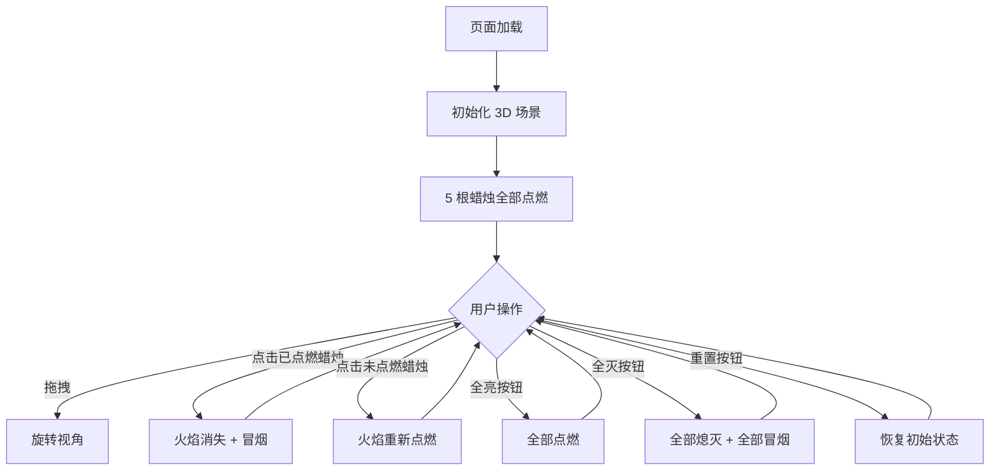

# 3D 生日蛋糕 - 产品需求文档 (PRD)

## 1. 产品概述

一个基于 Three.js 的 3D 生日蛋糕交互场景,用户可以 360° 旋转视角、点击未点燃的蜡烛进行点燃、再次点击(吹气动作)熄灭蜡烛并冒出烟雾粒子。本项目作为一个富有"惊喜感"和"仪式感"的小型互动产品,主要面向过生日的用户,用于发送祝福、营造氛围或作为创意贺卡的载体。

## 2. 核心功能

### 2.1 用户角色
本项目不涉及多角色,所有用户都是同一类访客,无需注册/登录。

### 2.2 功能模块
1. **3D 蛋糕主场景**:蛋糕主体、裱花、蜡烛、火焰、烟雾
2. **交互控制面板**:重置/全亮/全灭按钮、提示文字
3. **底部信息栏**:项目标题与生日祝福语

### 2.3 页面细节
| 页面/模块 | 名称 | 功能描述 |
|-----------|------|---------|
| 主场景 | 蛋糕渲染 | 展示 3 层蛋糕 + 5 根蜡烛,带阴影、PBR 材质 |
| 主场景 | 视角控制 | 鼠标拖拽旋转、滚轮缩放、自动慢速旋转 |
| 主场景 | 点燃蜡烛 | 点击未点燃的蜡烛,产生火焰(光晕 + 粒子) |
| 主场景 | 吹灭蜡烛 | 点击已点燃的蜡烛,火焰消失,冒出灰色烟雾粒子 |
| 控制面板 | 重置按钮 | 重置所有蜡烛状态,所有灯重新点燃 |
| 控制面板 | 全亮按钮 | 一键点燃全部蜡烛 |
| 控制面板 | 全灭按钮 | 一键吹灭全部蜡烛(全部冒烟) |
| 信息栏 | 标题 | 显示 "Happy Birthday" 艺术字样 |
| 信息栏 | 状态计数 | 实时显示当前点燃的蜡烛数,如 "3 / 5 lit" |

## 3. 核心流程

1. 用户打开页面 → 加载 3D 场景 → 5 根蜡烛全部点燃
2. 用户鼠标拖拽 → 旋转视角
3. 用户点击单根已点燃的蜡烛 → 该蜡烛火焰消失 → 升起烟雾(1.5s 消散)
4. 用户点击单根未点燃的蜡烛 → 该蜡烛重新点燃 → 火焰跳动
5. 用户点击 "全灭" → 5 根蜡烛全部熄灭 → 全部冒烟
6. 用户点击 "重置" → 烟雾散去,蜡烛重新点燃
7. 用户点击 "全亮" → 所有未点燃的蜡烛立即点燃

## 4. 用户界面设计

### 4.1 设计风格
- **主色调**:深空蓝到紫罗兰的渐变背景(营造夜空/派对氛围)
- **强调色**:暖金色(蜡烛火焰、按钮高亮)、玫瑰粉(裱花)
- **按钮风格**:半透明玻璃拟态(backdrop-blur)、圆角胶囊、悬停时发光
- **字体**:主标题使用展示型衬线字体 "Playfair Display" / "DM Serif Display";信息文字使用现代无衬线 "Inter" 或 "Manrope"
- **布局风格**:3D 场景全屏居中,顶部为标题,底部为控制面板
- **图标风格**:使用 lucide-react 图标(轻量线性),如 Flame、Wind、RotateCcw

### 4.2 页面设计概述
| 页面/模块 | UI 元素 | 详细描述 |
|-----------|---------|---------|
| 主场景 | Canvas | 全屏 Three.js Canvas,深色渐变背景 |
| 主场景 | 蛋糕 | 3 层圆柱蛋糕,每层颜色不同(粉/白/巧克力棕),表面有奶油裱花 |
| 主场景 | 蜡烛 | 5 根高低错落的蜡烛,顶端火焰(未点燃时为黑色烛芯) |
| 主场景 | 火焰 | 透明橙黄渐变 Sprite + 点光源,带轻微抖动 |
| 主场景 | 烟雾 | 灰色半透明粒子,向上飘动并逐渐扩大、淡出 |
| 顶部 | 标题 | "Happy Birthday" 艺术字体,带渐变金色,带轻微光晕 |
| 底部 | 状态栏 | 显示 "X / 5 candles lit" |
| 底部 | 按钮组 | Reset / Light All / Blow Out All 三个玻璃拟态按钮 |
| 右下 | 操作提示 | "Drag to rotate · Scroll to zoom · Click candles" |

### 4.3 响应式设计
- 桌面优先,最小支持 1024×768
- 在窄屏(<= 768px)下,按钮组收缩为图标按钮,标题缩小

### 4.4 3D 场景设计
- **环境/HDRI**:使用程序化生成的渐变环境光(深紫到深蓝),不依赖外部 HDRI 文件
- **光照设置**:
  - HemisphereLight(天空蓝/地面粉)强度 0.3
  - DirectionalLight 主光,模拟月光从右上方照射,带阴影
  - PointLight 跟随已点燃蜡烛(每根一根),颜色暖橙,强度随火焰抖动
- **相机设置**:PerspectiveCamera,FOV 50,初始位置 (0, 4, 8),看向 (0, 1.5, 0)
- **运动**:相机无强制运动,但场景在空闲时整体缓慢自转(0.2 rad/s),用户交互时暂停自转
- **构图**:蛋糕居中略偏下,顶部留白放标题,底部留空放控制条
- **交互与动画**:
  - 鼠标拖拽:OrbitControls
  - 滚轮:缩放(限制 minDistance=4, maxDistance=15)
  - 点击:Raycaster 拾取蜡烛
  - 火焰:轻微 scale 抖动 + 光强抖动
  - 烟雾:粒子从烛芯生成,1.5s 内 y 上升 1.5 单位,scale 0.2→0.8,opacity 1→0
- **后处理**:轻微 Bloom 效果强化火焰和烟雾
- **资源来源**:全部程序化生成,无外部模型/贴图依赖
- **性能预算**:Draw Call < 50,三角形 < 30k,目标 60fps(桌面)

## 5. 验收标准
1. 页面打开后 2 秒内出现可交互的 3D 蛋糕
2. 5 根蜡烛初始全部点燃
3. 拖拽鼠标可以流畅旋转视角(无卡顿)
4. 点击已点燃的蜡烛后,火焰立即消失,烟雾从烛芯升起
5. 点击未点燃的蜡烛后,火焰重新点燃
6. 点击 "全灭" 后 5 根蜡烛同时熄灭并冒烟
7. 点击 "重置" 后烟雾消散,所有蜡烛重新点燃
8. 状态栏正确反映当前点燃数
