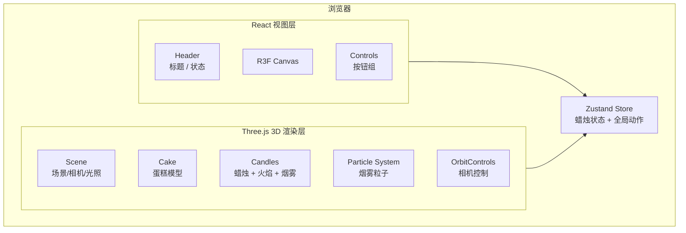

# 3D 生日蛋糕 - 技术架构文档

## 1. 架构设计

本项目为纯前端 3D 互动应用,无后端、无数据库。整体架构以 React 为视图层,以 Three.js + React Three Fiber 为 3D 渲染层,所有逻辑、状态、动画均在浏览器端执行。



## 2. 技术栈

- **构建工具**:Vite 5
- **前端框架**:React 18 + TypeScript
- **样式**:Tailwind CSS 3
- **3D 核心**:three(Three.js 0.160+)
- **3D React 绑定**:@react-three/fiber(Canvas 组件 + 声明式场景)
- **3D 辅助库**:@react-three/drei(OrbitControls、Stats、Html 等)
- **后处理**:@react-three/postprocessing(Bloom)
- **状态管理**:zustand
- **图标**:lucide-react
- **字体**:Google Fonts(Playfair Display + Manrope)通过 link 引入

## 3. 路由定义

本项目为单页应用,无路由。所有内容均渲染在根路径 `/` 上。

| 路由 | 用途 |
|------|------|
| `/` | 3D 生日蛋糕主场景 |

## 4. API 定义

无后端 API。所有状态在客户端管理。

## 5. 数据模型

### 5.1 蜡烛状态(CandleState)
```typescript
type CandleState = {
  id: number;             // 蜡烛编号 0-4
  position: [number, number, number]; // 蜡烛底部位置
  height: number;         // 蜡烛高度
  lit: boolean;           // 是否点燃
};

type Store = {
  candles: CandleState[];
  toggleCandle: (id: number) => void;
  lightAll: () => void;
  blowOutAll: () => void;
  reset: () => void;
};
```

### 5.2 烟雾粒子(运行时,不入 store)
每根被吹灭的蜡烛在 1.5s 内持续生成 20-30 个粒子(Points 或 Sprites),粒子属性:
- 起始位置:烛芯顶端
- 初速度:(0, 0.5, 0) + 轻微随机 x/z 偏移
- 生命周期:1.5s
- scale:0.2 → 0.8 线性插值
- opacity:1 → 0 线性插值
- 颜色:浅灰 (0.7, 0.7, 0.7)

## 6. 关键模块设计

### 6.1 组件结构
```
src/
  App.tsx                 # 根布局(Header + Canvas + Controls + Footer)
  main.tsx                # 入口
  index.css               # Tailwind 入口
  store/
    useCakeStore.ts       # zustand store
  components/
    Scene.tsx             # 3D 场景根组件(灯光、控制器)
    Cake.tsx              # 蛋糕主体(3 层)
    Candle.tsx            # 单根蜡烛(包含火焰、烟雾)
    Flame.tsx             # 火焰组件
    SmokeParticles.tsx    # 烟雾粒子组件
    Plate.tsx             # 底盘
  hooks/
    useSmoke.ts           # 烟雾粒子生命周期 hook
  utils/
    colors.ts             # 调色板常量
    layout.ts             # 蛋糕各层位置/高度
```

### 6.2 渲染策略
- **主画布**:单个 `<Canvas>` 全屏
- **OrbitControls**:drei 提供,启用 damping,设置 minDistance/maxDistance
- **Bloom**:postprocessing EffectComposer,强度 0.6,只强化亮色(火焰、标题)
- **阴影**:DirectionalLight 投射阴影,蛋糕接收阴影
- **自动旋转**:用户在 2 秒内无操作时,场景整体 Y 轴慢速旋转

### 6.3 交互实现
- **拾取**:使用 R3F 的 onClick + 自定义 userData.candleId 标识
- **状态写入**:点击事件直接调用 zustand action
- **火焰显示条件**:`{candle.lit && <Flame />}`
- **烟雾生成**:点击已点燃蜡烛 → 触发本地 React 状态 `emitSmoke`,在 1.5s 内渲染粒子,然后自动卸载

### 6.4 性能优化
- 火焰使用 Sprite(SpriteMaterial + CanvasTexture 程序化生成),共享同一张贴图
- 烟雾使用 Points(BufferGeometry),每根蜡烛最多 30 个粒子,过期自动回收
- 蛋糕装饰(裱花)使用 InstancedMesh
- 阴影贴图大小 1024,避免过大

## 7. 目录结构
```
traedata/
  .trae/
    documents/
      prd.md
      tech-arch.md
  index.html
  package.json
  vite.config.ts
  tailwind.config.js
  postcss.config.js
  tsconfig.json
  src/
    main.tsx
    App.tsx
    index.css
    store/
      useCakeStore.ts
    components/
      Scene.tsx
      Cake.tsx
      Candle.tsx
      Flame.tsx
      SmokeParticles.tsx
      Plate.tsx
      Header.tsx
      Controls.tsx
      Footer.tsx
    hooks/
      useAutoRotate.ts
    utils/
      colors.ts
      layout.ts
```

## 8. 依赖列表
```json
{
  "dependencies": {
    "react": "^18.3.1",
    "react-dom": "^18.3.1",
    "three": "^0.160.0",
    "@react-three/fiber": "^8.15.0",
    "@react-three/drei": "^9.99.0",
    "@react-three/postprocessing": "^2.16.0",
    "zustand": "^4.5.0",
    "lucide-react": "^0.400.0"
  },
  "devDependencies": {
    "@types/react": "^18.3.0",
    "@types/react-dom": "^18.3.0",
    "@types/three": "^0.160.0",
    "@vitejs/plugin-react": "^4.3.0",
    "autoprefixer": "^10.4.0",
    "postcss": "^8.4.0",
    "tailwindcss": "^3.4.0",
    "typescript": "^5.4.0",
    "vite": "^5.2.0"
  }
}
```
